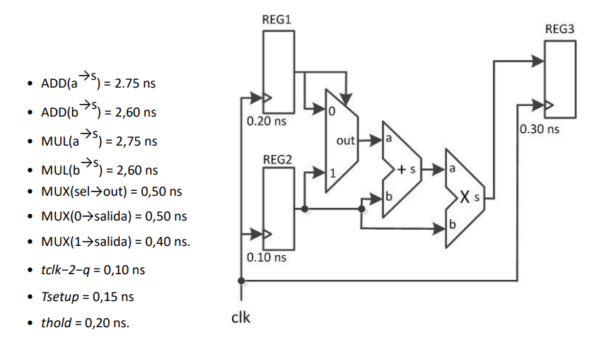
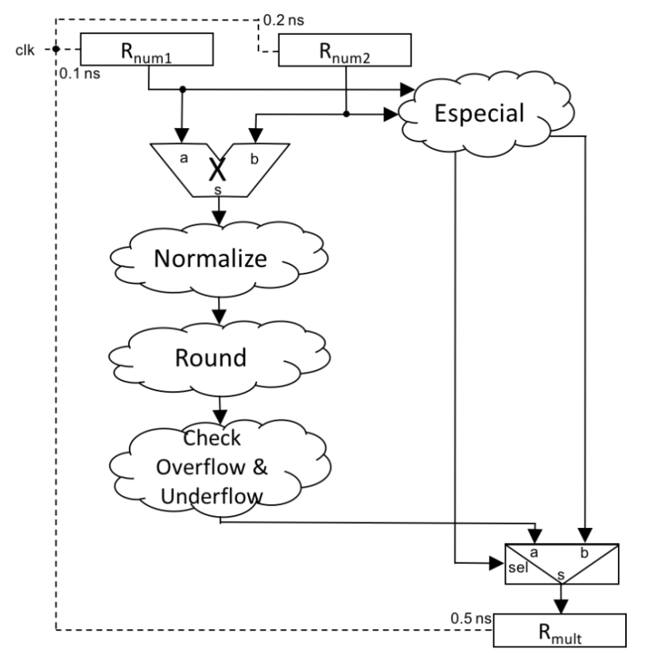
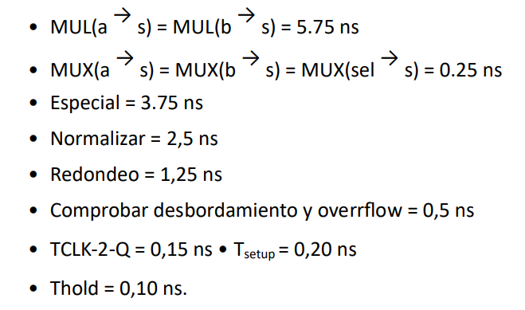
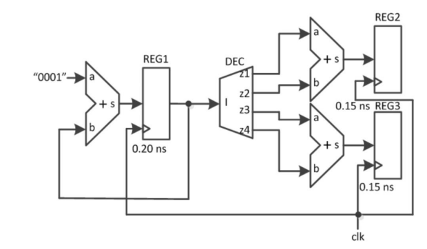
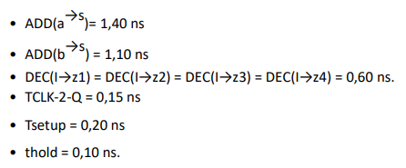
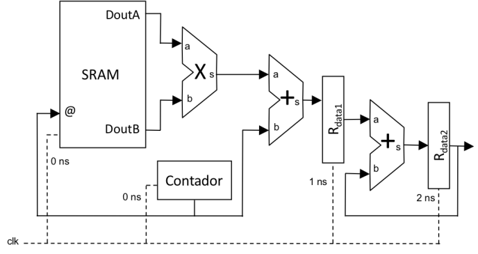
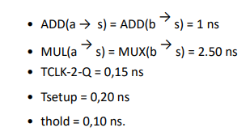
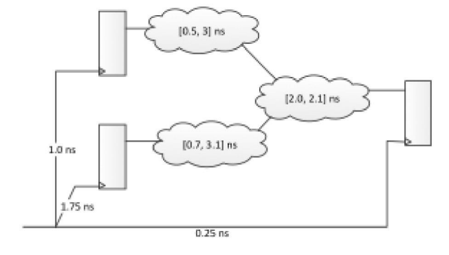
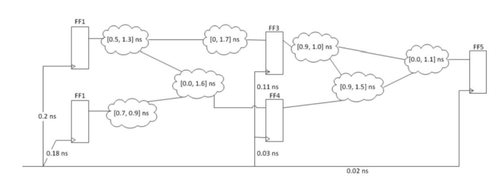
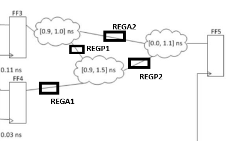

# Ejercicios TOC

## Mario González García

---

## Lección 2 – Análisis de hardware

### 1. Sobre el circuito de la imagen

#### ¿Podría este circuito funcionar correctamente a 250 MHz?

Veamos la condición de setup:

$$
T_{\text{clk}} = \frac{1}{250 MHz} = 4ns
$$

$$
\text{Máxima Suma lógica} = MUX + ADD + MUL = (0,5 + 2,75 + 2,75)ns = 6ns
$$

$$
t_{clk \to q}^{max} + t_{logica}^{max} + t_{setup} \leq T_{clk} + skew
$$

$$
(0,1 + 6 + 0,15) ns \leq (4 + (0,3 - 0,2))ns \; ? \to 6,25ns \leq 4,1ns  \; ?
$$

Al ser $6,25 > 4,1$ se observa que el circuito **no podrá** funcionar a $250 MHz$.

#### Indicar el rango de retardos de MUL(as) para que el circuito funcione a 250 MHz

Dejemos a MUL como incógnita:

$$
\text{Máxima Suma lógica} = MUX + ADD + MUL = (0,5 + 2,75 + MUL)ns = (3.25 + MUL) ns
$$

$$
t_{clk \to q}^{max} + t_{logica}^{max} + t_{setup} \leq T_{clk} + skew
$$

$$
(0,1 + 3,25 + MUL + 0,15) ns \leq (4 + (0,3 - 0,2))ns \; \to (3,5 + MUL) ns \leq 4,1ns \to MUL \leq 0,6ns
$$

Cualquier valor inferior a $0,6ns$ satisfacerá la condición de setup

#### ¿Si $MUL(as) = 2,60ns$ puede segmentarse el circuito para que el circuito funcione a $250MHz$?

$$
\text{Máxima Suma lógica} = MUX + ADD + MUL = (0,5 + 2,75 + 2,6)ns = 5,85ns
$$

Y esto, seguirá incumpliendo la condición de setup. Pero si segmentamos tras el ADDER:

$$
\text{Máxima Suma lógica} = MUX + ADD + MUL = (0,5 + 2,75)ns = 3,25ns
$$

Por tanto, si cumpliría la condición de setup:

$$
t_{clk \to q}^{max} + t_{logica}^{max} + t_{setup} \leq T_{clk} + skew
$$

$$
(0,1+3,25 + 0,15)ns \leq (4,2)ns \to 3,5ns \leq 4,1ns
$$

Idem, para la segunda etapa

$$
(0,1 + 2,6 + 0,15)ns \leq (4)ns \to 2,85ns \leq 4,1ns
$$

Al insertar el pipeline después del ADD estamos añadiendo una etapa de pipeline nueva en esa ruta. Para mantener la alineación temporal en el registro 3, cualquier ruta alternativa que llegue a este y no por el nuevo registro también debe recibir un registro intermedio equivalente. En otras palabras: todas las señales que entran al registro 3 deben estar pipelineadas con la misma cantidad de etapas para este circuito.

#### ¿Se viola condición de hold con la nueva segmentación?

Al haberse asegurado la alineación con el pipeline y otra segmentación, no existe una violación de la condición de hold, cumpliendo la inecuación:

$$
t_{clk \to q}^{min} + t_{logica}^{min} \geq t_{hold} + skew
$$

### 2. Sobre el circuito de la imagen

Tiempos y retardos:

#### ¿Podría este circuito funcionar correctamente a 100 MHz?

Existen dos rutas:

* **Ruta 1**: R_num1 : MUL : Normalize : Round : Check : MUX : R_mult
* **Ruta 2**: R_num2 : Especial : MUX : R_mult

La primera es la ruta crítica asi que calculemos si es funcional físicamente. Veamos la condición de setup:

$$
T_{\text{clk}} = \frac{1}{100 MHz} = 10ns
$$

$$
\text{Máxima Suma lógica} = MUL + Normalize + Round + Check + MUX = (5,75 + 2,5 + 1,25+ 0,5+ 0,25)ns = 10,25ns
$$

$$
t_{clk \to q}^{max} + t_{logica}^{max} + t_{setup} \leq T_{clk} + skew
$$

$$
(0,15 + 10,25 + 0,2) ns \leq (10 + (0,5 - 0,1))ns \; ? \to 10,6ns \leq 10,4ns  \; ?
$$

Al ser $10,6 > 10,4$ se observa que el circuito **no podrá** funcionar a $100 MHz$. Implícitamente la ruta crítica es la calculada.

#### Indicar el rango de frecuencias en las que el circuito SÍ puede funcionar

$$
t_{clk \to q}^{max} + t_{logica}^{max} + t_{setup} \leq T_{clk} + skew
$$

$$
t_{clk \to q}^{max} + t_{logica}^{max} + t_{setup} \leq \frac{1}{freq} + skew
$$

$$
freq \leq \frac{1}{t_{clk \to q}^{max} + t_{logica}^{max} + t_{setup} - skew}
$$

$$
freq \leq \frac{1}{(0,15  + 10,25 + 0,2 - 0,4)ns} \leq \frac{1}{10,2ns} = 98,04 MHz
$$

Por tanto, la frecuencia máxima, la mayor a la que podrá funcionar, es de $98,04MHz$.

#### Indicar la mejora arquitectónica para que pueda funcionar a la frecuencias deseada

Para solventar la violación de setup, añadiremos un registro de segmentación tras el MUL del camino crítico de tal modo que este se divide en dos etapas:

##### Etapa 1 para setup

R_num1 : MUL : R_P

$$
t_{clk \to q}^{max} + t_{logica}^{max} + t_{setup} \leq T_{clk} + skew
$$

$$
(0,15 + 5,75 + 0,2)ns \leq (10 + 0,1)ns \to 6,1ns \leq 10,1ns
$$

Se cumple la condición de setup.

##### Etapa 2 para setup

R_P : Normalize : Round : Check : MUX : R_mult

$$
t_{clk \to q}^{max} + t_{logica}^{max} + t_{setup} \leq T_{clk} + skew
$$

$$
(0,15 + 2,5 + 1,25 + 0,5 + 0,25 + 0,2)ns \leq (10 + 0,3)ns \to 4,85ns \leq 10,3ns
$$

Se cumple la condición de setup.

#### Condición de hold

El camino de Especial sigue siendo el más rapido por lo que comprobamos la restricción de hold para este:

$$
t_{clk \to q}^{min} + t_{logica}^{min} \geq t_{hold} + skew
$$

##### Etapa 1 para hold

R_num2 : Especial : R_P

$$
(0,15 + 3,75)ns \geq (0,1 + 0,1)ns \to 3,9ns \geq 0,2ns
$$

Se cumple la condición de hold.

##### Etapa 2 para hold

R_P : MUX : R_mult

$$
(0,15 + 0,25)ns \geq (0,1 + 0,3)ns \to 0,4ns \geq 0,4ns
$$

Se cumple la condición de hold.

Como se ha calculado, las condiciones se cumplen en cada camino y cada etapa. Como se puede apreciar, se ha considerado añadir un R_P en el camino no crítico ya que si no desicronizaríamos los datos del circuito, dejando este de ser funcional.

### 3. Sobre el circuito de la imagen

Tiempos y retardos:

#### ¿Podría este circuito funcionar correctamente a $500 MHz$? ¿A qué rangos de frecuencia puede ser funcional?

$$
T_{clk} = \frac{1}{freq} = \frac{1}{500MHz} = 2 \times 10^{-9}s = 2ns
$$

Identifiquemos el camino crítico (el otro camino sería el de realimentacion de REG1):

Reg1 - DEC - ADD - Reg2 / Reg3

Evaluemos la condición de setup:

$$
t_{clk \to q}^{max} + t_{logica}^{max} + t_{setup} \leq T_{clk} + skew
$$

$$
(0,15 + 0,6 + 1,4 + 0,2)ns \leq (2ns - (0,15 - 0,2))ns \; \to 2,35ns \leq 1,95ns ?
$$

Al violarse la condición de setup el circuito no será funcional físicamente. Ahora encontremos la frecuencia máxima:

$$
t_{clk \to q}^{max} + t_{logica}^{max} + t_{setup} \leq T_{clk} + skew
$$

$$
t_{clk \to q}^{max} + t_{logica}^{max} + t_{setup} \leq \frac{1}{freq} + skew
$$

$$
freq \leq \frac{1}{t_{clk \to q}^{max} + t_{logica}^{max} + t_{setup} - skew}
$$

$$
freq \leq \frac{1}{(0,15  + 2 + 0,2 + 0,05)ns} \leq \frac{1}{2,4ns} = 416,67 MHz
$$

Por lo que el circuito solo funcionará a menos o a $416,67 MHz$.

Igualmente evaluaremos la condición de hold:

$$
t_{clk \to q}^{min} + t_{logica}^{min} \geq t_{hold} + skew
$$

$$
0,15ns + 1,1ns \geq 0,1ns + 0ns \to 1,25ns \geq 0,1ns
$$

Se verifica la condición de hold

#### ¿A qué rango del decodificador funcionará el circuito a $500 MHz$?

Veamos que valores son necesario para que no se viole la condición de setup:

$$
t_{clk \to q}^{max} + t_{logica}^{max} + t_{setup} \leq T_{clk} + skew
$$

$$
t_{clk \to q}^{max} + t_{logica}^{max}(\text{sin DEC}) + DEC + t_{setup} \leq T_{clk} + skew
$$

$$
DEC \leq T_{clk} + skew - t_{clk \to q}^{max} - t_{logica}^{max}(\text{sin DEC}) - t_{setup}
$$

$$
DEC \leq 2ns - 0,05ns - 0,15ns - 1,4ns - 0,2ns = 0,2ns
$$

Por tanto, si solo alteramos el retardo del decodificador, para que el circuito funcione deberá ser como máximo de 0,2ns de retardo.

#### Indicar si es posible funcionar a la frecuencia deseada usando pipelining

Para solventar mediante segmentación añadiremos 4 registros a las salidas del decodificador. Evaluamos ahora la condición de setup en las dos etapas.

##### Etapa 1 (setup): Decodificador

$$
t_{clk \to q}^{max} + t_{logica}^{max} + t_{setup} \leq T_{clk} + skew
$$

$$
0,15ns + 0,6ns + 0,2ns \leq 2ns + (0,3 - 0,2)ns \to 0,95ns \leq 2,1ns
$$

Se verifica la condición de setup en la primera etapa.

##### Etapa 2 (setup): Sumador

$$
t_{clk \to q}^{max} + t_{logica}^{max} + t_{setup} \leq T_{clk} + skew
$$

$$
0,15ns + 1,4ns + 0,2ns \leq 2ns + (0,1 - 0,3)ns \to 1,75ns \leq 1,8ns
$$

Se verifica la condición de setup en la segunda etapa.

Ahora bien, el camino más corto ya no es el de retroalimentación (el cual no se puede segmentar por ser de feedback), es la primera nueva etapa, evaluemos la condición de hold:

##### Etapa 1 (hold): Decodificador

$$
t_{clk \to q}^{min} + t_{logica}^{min} \geq t_{hold} + skew
$$

$$
0,15ns + 0,6ns \geq 0,1ns + (0,3ns - 0,1ns) \to 0,85ns \geq 0,2ns
$$

Se verifica la condición de hold en el camino más corto, y, por ende, el circuito es funcional.

### 4. Sobre el circuito de la imagen

Tiempos y retardos:

#### Identificar el camino crítico y justificar si este circuito podría funcionar a $500 MHz$

Para encontrar el camino crítico evaluaremos las distintas rutas:

* **Ruta 1**: SRAM - MUL - ADD - RDATA1
* **Ruta 2**: RDATA1 - ADD - RDATA2
* **Ruta 3**: Contador - ADD - RDATA1
* **Ruta 4**: RDATA2 - ADD - RDATA2

Se aprecia fácilmente que la **Ruta 1** será el camino crítico, evaluemos ahora las condiciones de setup y hold.

$$
T_{clk} = \frac{1}{freq} = \frac{1}{500MHz} = 2ns
$$

Setup:

$$
t_{clk \to q}^{max} + t_{logica}^{max} + t_{setup} \leq T_{clk} + skew
$$

$$
0,15ns + 2,5ns + 1ns + 0,2ns \leq 2ns + (1ns - 0)  \to 3,85ns \leq 3ns
$$

No se verifica la condición así que el circuito ya **NO** es funcional.

Hold (ruta 4):

$$
t_{clk \to q}^{min} + t_{logica}^{min} \geq t_{hold} + skew
$$

$$
0,15ns + 1ns \geq 0,1ns + 0 \to 1,15ns \geq 0,1ns
$$

Se verifica la condición de hold.

#### ¿A qué rango del multiplicador funcionará el circuito a $500 MHz$?

Veamos que valores son necesario para que no se viole la condición de setup:

$$
t_{clk \to q}^{max} + t_{logica}^{max} + t_{setup} \leq T_{clk} + skew
$$

$$
t_{clk \to q}^{max} + t_{logica}^{max}(\text{sin MUL}) + MUL + t_{setup} \leq T_{clk} + skew
$$

$$
MUL \leq T_{clk} + skew - t_{clk \to q}^{max} - t_{logica}^{max}(\text{sin MUL}) - t_{setup}
$$

$$
MUL \leq 2ns + 1ns - 0,15ns - 2,5ns - 0,2ns = 0,15ns
$$

Por tanto, si solo alteramos el retardo del multiplicador, para que el circuito funcione deberá ser como máximo de 0,15ns de retardo.

#### ¿Sería posible segmentar el circuito y asegurar su funcionamiento?

El punto donde se debería segmentar el circuito sería tras el multiplicador. Para evitar la desincronización se añadirá un registro de alineación a la salida del contador.

Ahora analicemos la condición de setup únicamente, pues, la de hold ya fue verificada y no sé ha alterado dicha ruta:

##### Verificación etapa 1

$$
t_{clk \to q}^{max} + t_{logica}^{max} + t_{setup} \leq T_{clk} + skew
$$

$$
0,15ns + 2,5ns + 0,2ns \leq 2ns + (1ns - 0)  \to 2,85ns \leq 3ns
$$

Se verifica para esta primera etapa

##### Verificación etapa 2

$$
t_{clk \to q}^{max} + t_{logica}^{max} + t_{setup} \leq T_{clk} + skew
$$

$$
0,15ns + 1ns + 0,2ns \leq 2ns + 0  \to 1,35ns \leq 2ns
$$

Se verifica para esta segunda etapa

Por tanto, se puede justificar que con esa segmentación sería posible que el circuito funcionase a la frecuencia deseada.

### 5. Sobre el circuito de la imagen. Analizar si existen violaciones de tiempo. ¿Cuál es el margen del registro de destino? Idear una solución para una frecuencia de 200Mhz

Tiempos y retardos del circuito:

* $t_{clk \to q} = 0,4 ns$
* $t_{setup} = 0,25 ns$
* $t_{hold} = 0,1 ns$
* $freq = 100MHz$

#### Verificación de condiciones

$$
T_{clk} = \frac{1}{freq} = \frac{1}{100MHz} = 10ns
$$

##### Setup

$$
t_{clk \to q}^{max} + t_{logica}^{max} + t_{setup} \leq T_{clk} + skew
$$

$$
0,4ns + 3,1ns + 2,1ns + 0,25ns \leq 10ns + (0,25ns - 1,75ns) \; ? \to 5,85ns \leq 8,5ns \; ?
$$

No se viola la condicón de setup.

##### Hold

$$
t_{clk \to q}^{min} + t_{logica}^{min} \geq t_{hold} + skew
$$

$$
0,4ns + 0,5ns + 2ns \geq 0,1ns + (0,25ns - 1ns) \; ? \to 2,9ns \geq -0,65ns
$$

No se viola la condicón de hold.

#### Margen del registro de destino

##### Margen de setup

$$
margen_{setup} = T_{clk} + skew - (t_{clk \to q}^{max} + t_{logica}^{max} + t_{setup} + jitter)
$$

$$
margen_{setup} = 10ns +  (0,25ns - 1,75ns) - (3,1ns + 2,1ns + 0,25ns + 0) = 3,05ns
$$

##### Margen de hold

$$
margen_{hold} = t_{clk \to q}^{min} + t_{logica}^{min} - (skew + t_{hold} + jitter)
$$

$$
margen_{hold} = 0,5ns + 2,0ns - ((0,25ns - 1ns) + 0,1ns + 0) = 3,15ns
$$

#### Rediseño para $200 MHz$

Para asegurar la funcionalidad a la nueva frecuencia crearemos un pipeline detrás de los primeros componentes lógicos, así podremos cumplir la violación de setup y nos aseguraremos de que los datos esten alineados.

$$
T_{clk} = \frac{1}{freq} = \frac{1}{200MHz} = 5ns
$$

##### Setup en primera etapa

$$
t_{clk \to q}^{max} + t_{logica}^{max} + t_{setup} \leq T_{clk} + skew
$$

$$
0,15ns + 3,1ns + 0,25ns \leq 5ns + (0,45ns - 1,75ns) \to 3,5ns \leq 3,7ns
$$

Se cumple la condición.

##### Setup en segunda etapa

$$
t_{clk \to q}^{max} + t_{logica}^{max} + t_{setup} \leq T_{clk} + skew
$$

$$
0,15ns + 2,1ns + 0,25ns \leq 5ns + (0,25ns - 0,45ns) \to 2,5ns \leq 4,8ns
$$

Se cumple la condición.

##### Hold en primera etapa

$$
t_{clk \to q}^{min} + t_{logica}^{min} \geq t_{hold} + skew
$$

$$
0,15ns + 0,5ns \leq 0,1ns + (0,45ns - 1ns) \to 0,65ns \leq -0,45ns
$$

Se cumple la condición.

##### Hold en segunda etapa

$$
t_{clk \to q}^{min} + t_{logica}^{min} \geq t_{hold} + skew
$$

$$
0,15ns + 2ns \leq 0,1ns + (0,25ns - 0,45ns) \to 2,15ns \leq -0,1ns
$$

Se cumple la condición.

Una vez verificadas todas las condiciones podemos afirmar que añadiendo los dos pipeline el circuito será funcional a la frecuencia deseada.

### 6. Sobre el circuito de la imagen

Tiempos y retardos del circuito:

* $t_{clk \to q} = 0,12 ns$
* $t_{setup} = 0,1 ns$
* $t_{hold} = 0,05 ns$

#### Indicar los márgenes de setup para una frecuencia de $250 MHz$ y la verificación de las condiciones de setup

Los registros de destino son FF3, FF4 y FF5.

$$
T_{clk} = \frac{1}{freq} = \frac{1}{250MHz} = 4ns
$$

##### Margen de FF3

$$
margen_{setup} = T_{clk} + skew - (t_{clk \to q}^{max} + t_{logica}^{max} + t_{setup} + jitter)
$$

$$
margen_{setup} = 4ns +  (0,11ns - 0,2ns) - (0,12ns + 1,3ns + 1,7ns + 0,1ns + 0) = 0,69ns
$$

##### Margen de FF4

$$
margen_{setup} = T_{clk} + skew - (t_{clk \to q}^{max} + t_{logica}^{max} + t_{setup} + jitter)
$$

$$
margen_{setup} = 4ns +  (0,11ns - 0,2ns) - (0,12ns + 0,9ns + 1,6ns + 0,1ns + 0) = 1,19ns
$$

##### Margen de FF5

$$
margen_{setup} = T_{clk} + skew - (t_{clk \to q}^{max} + t_{logica}^{max} + t_{setup} + jitter)
$$

$$
margen_{setup} = 4ns +  (0,02ns - 0,03ns) - (0,12ns + 1ns + 1,5ns + 1,1ns + 0,1ns + 0) = 0,17ns
$$

El camino crítico (FF5) tiene margen positivo (0,17) por lo tanto no habrá violación de conficto de setup

#### Hallar la frecuencia máxima

$$
t_{clk \to q}^{max} + t_{logica}^{max} + t_{setup} \leq T_{clk} + skew
$$

$$
t_{clk \to q}^{max} + t_{logica}^{max} + t_{setup} \leq \frac{1}{freq} + skew
$$

$$
freq \leq \frac{1}{t_{clk \to q}^{max} + t_{logica}^{max} + t_{setup} - skew}
$$

$$
freq \leq \frac{1}{(0,12 + 1 + 1,5 + 1,1 + 0,1 - (0,11 - 0,2))ns} \leq \frac{1}{3,91ns} = 255,75 MHz
$$

El circuito podrá ser funcional físicamente a $255,75 MHz$ o menos.

#### Encontrar mejora estructural (segmentación) para funcionar a $500MHz$

Para evitar la violación de setup se colocarán dos tramos registros, uno a las dos entradas de la última lógica previa a FF5 y otro intermedio previo a la nube inferior (conectada con la nube superior izquierda y FF4). El skew se despreciará, pues desconocemos el desfase para los nuevos registros de segmentación. Evaluaremos ahora de nuevo las tres etapas nuevas:

$$
T_{clk} = \frac{1}{freq} = \frac{1}{500MHz} = 2ns
$$

##### Etapa 1 (FF3 - REGP1)

$$
t_{clk \to q}^{max} + t_{logica}^{max} + t_{setup} \leq T_{clk} + skew
$$

$$
0,15ns + 1.0ns + 0,1ns \leq  2ns \to 1,25ns \leq 2ns
$$

Se cumple la condición de setup para la primera etapa.

##### Etapa 2 (REGP1 - REGP2)

$$
t_{clk \to q}^{max} + t_{logica}^{max} + t_{setup} \leq T_{clk} + skew
$$

$$
0,15ns + 1.5ns + 0,1ns \leq  2ns \to 1,75ns \leq 2ns
$$

Se cumple la condición de setup para la segunda etapa.

##### Etapa 3 (REGP2 - FF5)

$$
t_{clk \to q}^{max} + t_{logica}^{max} + t_{setup} \leq T_{clk} + skew
$$

$$
0,15ns + 1.1ns + 0,1ns \leq  2ns \to 1,35ns \leq 2ns
$$

Se cumple la condición de setup para la tercera etapa

Aquí se añade un dibujo con los registros de segmentación y alineado añadidos.

