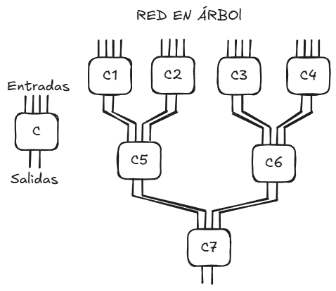
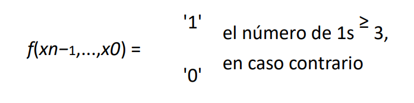

# Ejercicios TOC

## Mario González García

---

## Lección 3 - Diseño combinatorio avanzado

### 1. Diseñar una red de árbol iterativa con las siguientes condiciones
  
- Entrada de 16 bits
- Salida de 2 bits
- Salida: '11' si hay 2 o más bits de la entrada a '1'
- Cada celda procesa 4 bits



Como se puede observar en el esquema, una celda tiene 4 entradas y 2 salidas, estas últimas se calcularán como:

- '00' : no hay ningún '1' en las entradas
- '01' : hay un '1' en las entradas
- '10' : no es de interés
- '11' : hay dos '1' en las entradas

Una vez diseñado el circuito en boceto, la implementación sería:

```vhdl
library ieee;
use ieee.std_logic_1164.all;

entity cell is 
  port(
    A : in std_logic_vector(1 downto 0);
    B : in std_logic_vector(1 downto 0);
    R : out std_logic_vector(1 downto 0)
  );
end cell;

architecture rtl of cell is
  signal a_val, b_val : integer range 0 to 2;
  signal sum : integer range 0 to 2;
begin

  a_val <= 0 when A = "00" else
           1 when A = "01" else
           1 when A = "10" else
           2;

  b_val <= 0 when B = "00" else
           1 when B = "01" else
           1 when B = "10" else
           2;

  sum <= 0 when (a_val + b_val = 0) else
           1 when (a_val + b_val = 1) else
           2;

  R <= "00" when sum = 0 else
       "01" when sum = 1 else
       "11";
end rtl;

entity tree is
  port(
    X : in std_logic_vector(15 downto 0);
    Z : in std_logic_vector(1 downto 0)
  );
end tree;

architecture rtl of tree is
  signal r : array (0 to 6) of std_logic_vector(1 downto 0);
begin

  -- NIVEL 1
  gen_level1: for i in 0 to 3 generate
  begin
    C_inst : entity cell
      port map(
        A => X(4*i + 1 downto 4 * i),
        B => X(4*i + 3 downto 4 * i + 2),
        R => r(i)
      );
  end generate gen_level1;

  -- NIVEL 2
  gen_level2: for i in 0 to 1 generate
  begin
    C_inst : entity cell
      port map(
        A => r(2 * i),
        B => r(2 * i + 1),
        R => r(4 + i)
      );
  end generate gen_level2;

  -- NIVEL 3
  C_final : entity cell
    port map (
      A => r(4),
      B => r(5),
      R => Z
    );
end architecture rtl;
```

### 2. Diseñar una red iterativa que calcule el C2 de un número con 4 bits

```vhdl
library ieee;
use ieee.std_logic_1164.all;

entity cell is
  port (
    x : in std_logic;
    cin: in std_logic;
    z: out std_logic;
    cout: out std_logic;
  );
end cell;

architecture rtl of cell is
begin
  process(x, cin)
  begin
    if cin = '1' then
      if x = '0' then
        z <= '1';
        cout <= '0';
      else
        z <= '0';
        cout <= '1';
      end if;
    else
      z <= not x;
      cout <= '0';
    end if;
  end process;
end rtl;

entity net is
  port (
    X : in std_logic_vector(3 downto 0);
    Z : out std_logic_vector(3 downto 0)
  );
end entity;

architecture rtl of net is
  signal c : std_logic_vector(4 downto 0);
begin
  c(0) <= '1';

  gen_celdas : for i in 0 to 3 generate
  begin
    U : entity cell
      port map(
        x => X(i),
        cin => c(i),
        z => Z(i),
        cout => c(i+1) 
      );
  end generate gen_celdas;
end architecture;
```

### 3. Diseñar una red iterativa que cumpla



```vhdl
library ieee;
use ieee.std_logic_1164.all;

entity cell is
    port(
        x     : in  std_logic;
        s_in  : in  std_logic_vector(1 downto 0);
        s_out : out std_logic_vector(1 downto 0)
    );
end entity;

architecture rtl of cell is
    signal s_val : integer range 0 to 3;
begin
    s_val <= 0 when s_in = "00" else
             1 when s_in = "01" else
             2 when s_in = "10" else
             3;

    process(x, s_val)
        variable next_s : integer range 0 to 3;
    begin
        if x = '1' then
            if s_val < 3 then
                next_s := s_val + 1;
            else
                next_s := 3;
            end if;
        else
            next_s := s_val;
        end if;

        case next_s is
            when 0 => s_out <= "00";
            when 1 => s_out <= "01";
            when 2 => s_out <= "10";
            when others => s_out <= "11";
        end case;
    end process;
end architecture;

entity net is
    generic(n : integer := 8);
    port(
        X : in  std_logic_vector(n-1 downto 0);
        Z : out std_logic
    );
end entity;

architecture rtl of net is
    signal s : std_logic_vector(0 to n);
begin
    s(0) <= "00";

    gen: for i in 0 to n-1 generate
    begin
        U: entity cell
            port map(
                x     => X(i),
                s_in  => s(i),
                s_out => s(i+1)
            );
    end generate;

    Z <= '1' when s(n) = "11" else '0';
end architecture;
```

### 4.  Diseñar una red iterativa que

- La salida sea la distancia entre los dos únicos '1' del vector
- La distancia es siempre menor o igual que 7

```vhdl
library ieee;
use ieee.std_logic_1164.all;

entity cell is
    port(
        x      : in  std_logic;
        s_in   : in  std_logic_vector(1 downto 0);
        d_in   : in  std_logic_vector(2 downto 0);
        s_out  : out std_logic_vector(1 downto 0);
        d_out  : out std_logic_vector(2 downto 0)
    );
end entity;

architecture rtl of cell is
begin
    process(x, s_in, d_in)
        variable s : integer range 0 to 2;
        variable d : integer range 0 to 7;
        variable ns : integer range 0 to 2;
        variable nd : integer range 0 to 7;
    begin
        s := to_integer(unsigned(s_in));
        d := to_integer(unsigned(d_in));
        
        ns := s;
        nd := d;

        case s is
            when 0 =>
                if x = '1' then 
                    ns := 1;
                    nd := 0;
                end if;

            when 1 =>
                if x = '1' then 
                    ns := 2;
                else
                    nd := d + 1;
                end if;

            when 2 =>
                null;
                
            when others =>
                null;
        end case;

        s_out <= std_logic_vector(to_unsigned(ns, 2));
        d_out <= std_logic_vector(to_unsigned(nd, 3));
    end process;
end architecture;

entity net is
    generic(n : integer := 16);
    port(
        X : in  std_logic_vector(n-1 downto 0);
        Z : out std_logic_vector(2 downto 0)
    );
end entity;

architecture rtl of net is
    type state_array is array(0 to n) of std_logic_vector(1 downto 0);
    type dist_array is array(0 to n) of std_logic_vector(2 downto 0);
    
    signal s : state_array;
    signal d : dist_array;
begin
    s(0) <= "00";
    d(0) <= "000";

    gen: for i in 0 to n-1 generate
        U: entity cell
            port map(
                x     => X(i),
                s_in  => s(i),
                d_in  => d(i),
                s_out => s(i+1),
                d_out => d(i+1)
            );
    end generate;

    Z <= d(n);
end architecture;
```

### 5. Diseñar una red iterativa que

- Tenga 8 entradas (x7,... x0)
- Tenga 3 salidas (y2, y1, y0)
- La salida calcula el número de ocasiones que se repiten las combinaciones "010" y "110"

```vhdl
library ieee;
use ieee.std_logic_1164.all;

entity cell is
    port(
        x : in std_logic;
        s_in : in std_logic_vector(1 downto 0);
        c_in : in std_logic_vector(2 downto 0);
        s_out : out std_logic_vector(1 downto 0);
        c_out : out std_logic_vector(2 downto 0)
    );
end entity;

architecture rtl of cell is
begin
    process(x, s_in, c_in)
        variable s : integer range 0 to 3;
        variable c : integer range 0 to 7;
        variable ns : integer range 0 to 3;
        variable nc : integer range 0 to 7;
    begin
        s := to_integer(unsigned(s_in));
        c := to_integer(unsigned(c_in));
        
        ns := s;
        nc := c;

        case s is
            when 0 =>
                if x = '0' then
                    ns := 1;
                elsif x = '1' then
                    ns := 2;
                end if;

            when 1 =>
                if x = '1' then
                    ns := 3;
                elsif x = '0' then
                    ns := 1;
                end if;

            when 2 =>
                if x = '1' then
                    ns := 2;
                elsif x = '0' then
                    ns := 1;
                end if;

            when 3 =>
                if x = '0' then
                    nc := c + 1;
                    ns := 1;
                elsif x = '1' then
                    ns := 2;
                end if;

            when others =>
                null;
        end case;

        s_out <= std_logic_vector(to_unsigned(ns, 2));
        c_out <= std_logic_vector(to_unsigned(nc, 3));
    end process;
end architecture;

entity net is
    port(
        X : in std_logic_vector(7 downto 0);
        Y : out std_logic_vector(2 downto 0)
    );
end entity;

architecture rtl of net is
    type state_array is array(0 to 8) of std_logic_vector(1 downto 0);
    type count_array is array(0 to 8) of std_logic_vector(2 downto 0);
    
    signal s : state_array;
    signal c : count_array;
begin
    s(0) <= "00";
    c(0) <= "000";

    gen: for i in 0 to 7 generate
        U: entity cell
            port map(
                x => X(i),
                s_in => s(i),
                c_in => c(i),
                s_out => s(i+1),
                c_out => c(i+1)
            );
    end generate;

    Y <= c(8);
end architecture;
```

### 6. Diseñar una red iterativa que

- Reciba un vector de n bits de entrada
- Tenga una salida en forma de vector de n bits
- Cada bit de salida Z(i) debe indicar si en X hay cuatro 1 consecutivos (es decir, la racha “1111”) cuando llegamos a ese bit
- Las señales intermedias entre celdas deben tener exactamente 2 bits

```vhdl
library ieee;
use ieee.std_logic_1164.all;

entity cell is
    port(
        x : in std_logic;
        state_in : in std_logic_vector(1 downto 0);
        z : out std_logic;
        state_out : out std_logic_vector(1 downto 0)
    );
end entity;

architecture rtl of cell is
begin
    process(x, state_in)
    begin
        case state_in is
            when "00" =>
                if x = '1' then
                    state_out <= "01";
                else
                    state_out <= "00";
                end if;
                z <= '0';
                
            when "01" =>
                if x = '1' then
                    state_out <= "10";
                else
                    state_out <= "00";
                end if;
                z <= '0';
                
            when "10" =>
                if x = '1' then
                    state_out <= "11";
                else
                    state_out <= "00";
                end if;
                z <= '0';
                
            when "11" =>
                if x = '1' then
                    state_out <= "11";
                    z <= '1';
                else
                    state_out <= "00";
                    z <= '0';
                end if;
                
            when others =>
                state_out <= "00";
                z <= '0';
        end case;
    end process;
end architecture;

entity net is
    generic(n : integer := 8);
    port(
        X : in std_logic_vector(n-1 downto 0);
        Z : out std_logic_vector(n-1 downto 0)
    );
end entity;

architecture rtl of net is
    type state_array is array(0 to n) of std_logic_vector(1 downto 0);
    signal s : state_array;
begin
    s(0) <= "00";

    gen: for i in 0 to n-1 generate
        U: entity cell
            port map(
                x => X(i),
                state_in => s(i),
                z => Z(i),
                state_out => s(i+1)
            );
    end generate;
end architecture;
```

#### Con las puertas lógicas teniendo un retardo de 1ns calcula el retardo total

El retardo total de la red iterativa es de 8 ns.

**Justificación:**

- La red tiene 8 celdas iterativas encadenadas (una por cada bit de entrada X(7..0)).
- Cada celda es completamente combinacional.
- Cada puerta lógica de 2 entradas tiene 1 ns de retardo.
- La implementación de la celda funciona como un único nivel combinacional desde las entradas (x, s_in, c_in) hasta las salidas (s_out, c_out).
- En una red iterativa, el retardo total es el retardo de una celda multiplicado por el número de celdas.
- Por tanto: 8 celdas × 1 ns por celda = 8 ns.

### 7. Diseñar una red iterativa que

- Reciba un vector de n bits de entrada
- Esté implementada solo con puertas lógicas de 2 entradas
- Reconozca el patron "101"
- Se supone que el LSB del patrón solamente aparece en las posiciones múltiplo de 3

```vhdl
library ieee;
use ieee.std_logic_1164.all;

entity cell is
    port(
        x : in std_logic;
        s_in : in std_logic_vector(1 downto 0);
        pos_in : in std_logic_vector(1 downto 0);
        z : out std_logic;
        s_out : out std_logic_vector(1 downto 0);
        pos_out : out std_logic_vector(1 downto 0)
    );
end entity;

architecture rtl of cell is
begin
    process(x, s_in, pos_in)
        variable s : integer range 0 to 2;
        variable pos : integer range 0 to 2;
        variable ns : integer range 0 to 2;
        variable npos : integer range 0 to 2;
    begin
        s := to_integer(unsigned(s_in));
        pos := to_integer(unsigned(pos_in));
        
        ns := s;
        npos := pos;
        z <= '0';

        if pos = 0 then
            if x = '1' then
                ns := 1;
            else
                ns := 0;
            end if;
            npos := 1;
        elsif pos = 1 then
            if s = 1 then
                if x = '0' then
                    ns := 2;
                else
                    ns := 0;
                end if;
            end if;
            npos := 2;
        elsif pos = 2 then
            if s = 2 then
                if x = '1' then
                    z <= '1';
                    ns := 0;
                else
                    ns := 0;
                end if;
            end if;
            npos := 0;
        end if;

        s_out <= std_logic_vector(to_unsigned(ns, 2));
        pos_out <= std_logic_vector(to_unsigned(npos, 2));
    end process;
end architecture;

entity net is
    generic(n : integer := 12);
    port(
        X : in std_logic_vector(n-1 downto 0);
        Z : out std_logic_vector(n-1 downto 0)
    );
end entity;

architecture rtl of net is
    type state_array is array(0 to n) of std_logic_vector(1 downto 0);
    type pos_array is array(0 to n) of std_logic_vector(1 downto 0);
    
    signal s : state_array;
    signal pos : pos_array;
begin
    s(0) <= "00";
    pos(0) <= "00";

    gen: for i in 0 to n-1 generate
        U: entity cell
            port map(
                x => X(i),
                s_in => s(i),
                pos_in => pos(i),
                z => Z(i),
                s_out => s(i+1),
                pos_out => pos(i+1)
            );
    end generate;
end architecture;
```

### 8. Diseñar una red iterativa que

- Parta de la solución del ejercicio 7
- Añada sumadores de k bits
- La salida calcule el número de patrones detectados

```vhdl
library ieee;
use ieee.std_logic_1164.all;

entity cell is
    port(
        x : in std_logic;
        s_in : in std_logic_vector(1 downto 0);
        pos_in : in std_logic_vector(1 downto 0);
        count_in : in std_logic_vector(6 downto 0);
        s_out : out std_logic_vector(1 downto 0);
        pos_out : out std_logic_vector(1 downto 0);
        count_out : out std_logic_vector(6 downto 0)
    );
end entity;

architecture rtl of cell is
begin
    process(x, s_in, pos_in, count_in)
        variable s : integer range 0 to 2;
        variable pos : integer range 0 to 2;
        variable count : integer range 0 to 127;
        variable ns : integer range 0 to 2;
        variable npos : integer range 0 to 2;
        variable ncount : integer range 0 to 127;
        variable match : std_logic;
    begin
        s := to_integer(unsigned(s_in));
        pos := to_integer(unsigned(pos_in));
        count := to_integer(unsigned(count_in));
        
        ns := s;
        npos := pos;
        ncount := count;
        match := '0';

        if pos = 0 then
            if x = '1' then
                ns := 1;
            else
                ns := 0;
            end if;
            npos := 1;
        elsif pos = 1 then
            if s = 1 then
                if x = '0' then
                    ns := 2;
                else
                    ns := 0;
                end if;
            end if;
            npos := 2;
        elsif pos = 2 then
            if s = 2 then
                if x = '1' then
                    match := '1';
                    ns := 0;
                else
                    ns := 0;
                end if;
            end if;
            npos := 0;
        end if;

        if match = '1' then
            ncount := count + 1;
        end if;

        s_out <= std_logic_vector(to_unsigned(ns, 2));
        pos_out <= std_logic_vector(to_unsigned(npos, 2));
        count_out <= std_logic_vector(to_unsigned(ncount, 7));
    end process;
end architecture;

entity net is
    generic(n : integer := 300);
    port(
        X : in std_logic_vector(n-1 downto 0);
        Z : out std_logic_vector(6 downto 0)
    );
end entity;

architecture rtl of net is
    type state_array is array(0 to n) of std_logic_vector(1 downto 0);
    type pos_array is array(0 to n) of std_logic_vector(1 downto 0);
    type count_array is array(0 to n) of std_logic_vector(6 downto 0);
    
    signal s : state_array;
    signal pos : pos_array;
    signal count : count_array;
begin
    s(0) <= "00";
    pos(0) <= "00";
    count(0) <= "0000000";

    gen: for i in 0 to n-1 generate
        U: entity cellcell
            port map(
                x => X(i),
                s_in => s(i),
                pos_in => pos(i),
                count_in => count(i),
                s_out => s(i+1),
                pos_out => pos(i+1),
                count_out => count(i+1)
            );
    end generate;

    Z <= count(n);
end architecture;
```

#### Calcular el retardo para n = 300, con el retado en puertas lógicas en 10ps y los sumadores 30 ps

El retardo total de la red iterativa es de 12 ns.

**Justificación:**

- El diseño usa una red iterativa de 300 celdas completamente combinacionales.
- Cada celda tiene dos contribuciones al retardo: lógica de la puerta + sumador de k bits
- El retardo por celda es de 40ps
- La implementación de la celda funciona como un único nivel combinacional desde las entradas (x, s_in, c_in) hasta las salidas (s_out, c_out).
- En una red iterativa, el retardo total es el retardo de una celda multiplicado por el número de celdas.
- Las 300 celdas están en serie (no hay registros intermedios), así que el retardo total es:

$$
300 \cdot 40ps = 12 000 ps = 12 ns
$$

### 9. Diseñar un decodificador de 20 bits

#### a) Usando un árbol de decodificadores de 4 bits

- Módulos: 1 + 16 + 256 + 4096 + 65536 = 69905 decodificadores de 4 bits
- Niveles: 5 niveles

**Implentación:**

```vhdl
library ieee;
use ieee.std_logic_1164.all;

entity decoder_4to16 is
    port(
        A : in std_logic_vector(3 downto 0);
        EN : in std_logic;
        Y : out std_logic_vector(15 downto 0)
    );
end entity;

architecture rtl of decoder_4to16 is
begin
    process(A, EN)
    begin
        Y <= (others => '0');
        if EN = '1' then
            case A is
                when "0000" => Y(0) <= '1';
                when "0001" => Y(1) <= '1';
                when "0010" => Y(2) <= '1';
                when "0011" => Y(3) <= '1';
                when "0100" => Y(4) <= '1';
                when "0101" => Y(5) <= '1';
                when "0110" => Y(6) <= '1';
                when "0111" => Y(7) <= '1';
                when "1000" => Y(8) <= '1';
                when "1001" => Y(9) <= '1';
                when "1010" => Y(10) <= '1';
                when "1011" => Y(11) <= '1';
                when "1100" => Y(12) <= '1';
                when "1101" => Y(13) <= '1';
                when "1110" => Y(14) <= '1';
                when "1111" => Y(15) <= '1';
                when others => null;
            end case;
        end if;
    end process;
end architecture;

entity decoder_20_tree is
    port(
        A : in std_logic_vector(19 downto 0);
        Y : out std_logic_vector(1048575 downto 0)
    );
end entity;

architecture tree of decoder_20_tree is
    signal level1_out : std_logic_vector(15 downto 0);
    signal level2_out : std_logic_vector(255 downto 0);
    signal level3_out : std_logic_vector(4095 downto 0);
    signal level4_out : std_logic_vector(65535 downto 0);
begin
    dec1: entity decoder_4to16
        port map(
            A => A(19 downto 16),
            EN => '1',
            Y => level1_out
        );

    gen_level2: for i in 0 to 15 generate
        dec2: entity decoder_4to16
            port map(
                A => A(15 downto 12),
                EN => level1_out(i),
                Y => level2_out((i+1)*16-1 downto i*16)
            );
    end generate;

    gen_level3: for i in 0 to 255 generate
        dec3: entity decoder_4to16
            port map(
                A => A(11 downto 8),
                EN => level2_out(i),
                Y => level3_out((i+1)*16-1 downto i*16)
            );
    end generate;

    gen_level4: for i in 0 to 4095 generate
        dec4: entity decoder_4to16
            port map(
                A => A(7 downto 4),
                EN => level3_out(i),
                Y => level4_out((i+1)*16-1 downto i*16)
            );
    end generate;

    gen_level5: for i in 0 to 65535 generate
        dec5: entity decoder_4to16
            port map(
                A => A(3 downto 0),
                EN => level4_out(i),
                Y => Y((i+1)*16-1 downto i*16)
            );
    end generate;
end architecture;
```

#### b) Usando decodificadores de 4 bits en paralelo

- Módulos:  5 decodificadores
- Puertas lógicas: 1048576 puertas

**Implentación:**

```vhdl
library ieee;
use ieee.std_logic_1164.all;

entity decoder_4to16 is
    port(
        A : in std_logic_vector(3 downto 0);
        EN : in std_logic;
        Y : out std_logic_vector(15 downto 0)
    );
end entity;

architecture rtl of decoder_4to16 is
begin
    process(A, EN)
    begin
        Y <= (others => '0');
        if EN = '1' then
            case A is
                when "0000" => Y(0) <= '1';
                when "0001" => Y(1) <= '1';
                when "0010" => Y(2) <= '1';
                when "0011" => Y(3) <= '1';
                when "0100" => Y(4) <= '1';
                when "0101" => Y(5) <= '1';
                when "0110" => Y(6) <= '1';
                when "0111" => Y(7) <= '1';
                when "1000" => Y(8) <= '1';
                when "1001" => Y(9) <= '1';
                when "1010" => Y(10) <= '1';
                when "1011" => Y(11) <= '1';
                when "1100" => Y(12) <= '1';
                when "1101" => Y(13) <= '1';
                when "1110" => Y(14) <= '1';
                when "1111" => Y(15) <= '1';
                when others => null;
            end case;
        end if;
    end process;
end architecture;

entity decoder_20_parallel is
    port(
        A : in std_logic_vector(19 downto 0);
        Y : out std_logic_vector(1048575 downto 0)
    );
end entity;

architecture parallel of decoder_20_parallel is
    type array_16 is array(0 to 4) of std_logic_vector(15 downto 0);
    signal partial : array_16;
begin
    gen_decoders: for i in 0 to 4 generate
        dec: entity decoder_4to16
            port map(
                A => A((i+1)*4-1 downto i*4),
                EN => '1',
                Y => partial(i)
            );
    end generate;

    gen_outputs: for i in 0 to 1048575 generate
        Y(i) <= partial(0)(i mod 16) and 
                partial(1)((i/16) mod 16) and 
                partial(2)((i/256) mod 16) and 
                partial(3)((i/4096) mod 16) and 
                partial(4)((i/65536) mod 16);
    end generate;
end architecture;
```

### 10. Diseñar un entramado de matriz de 8 × 8 que produzca la salida 1 si hay una fila o una columna que tenga dos 1 consecutivos

```vhdl
library ieee;
use ieee.std_logic_1164.all;

entity row_checker is
    port(
        row : in std_logic_vector(7 downto 0);
        has_consecutive : out std_logic
    );
end entity;

architecture rtl of row_checker is
    signal consecutive : std_logic_vector(6 downto 0);
begin
    gen: for i in 0 to 6 generate
        consecutive(i) <= row(i) and row(i+1);
    end generate;
    
    has_consecutive <= consecutive(0) or consecutive(1) or consecutive(2) or 
                       consecutive(3) or consecutive(4) or consecutive(5) or 
                       consecutive(6);
end architecture;

entity matrix_8x8 is
    port(
        M : in std_logic_vector(63 downto 0);
        Z : out std_logic
    );
end entity;

architecture rtl of matrix_8x8 is
    type matrix_type is array(0 to 7) of std_logic_vector(7 downto 0);
    signal rows : matrix_type;
    signal cols : matrix_type;
    signal row_results : std_logic_vector(7 downto 0);
    signal col_results : std_logic_vector(7 downto 0);
begin
    gen_rows: for i in 0 to 7 generate
        rows(i) <= M((i+1)*8-1 downto i*8);
    end generate;
    
    gen_cols: for j in 0 to 7 generate
        gen_col_bits: for i in 0 to 7 generate
            cols(j)(i) <= M(i*8 + j);
        end generate;
    end generate;
    
    gen_row_checkers: for i in 0 to 7 generate
        row_check: entity row_checker
            port map(
                row => rows(i),
                has_consecutive => row_results(i)
            );
    end generate;
    
    gen_col_checkers: for j in 0 to 7 generate
        col_check: entity row_checker
            port map(
                row => cols(j),
                has_consecutive => col_results(j)
            );
    end generate;
    
    Z <= row_results(0) or row_results(1) or row_results(2) or row_results(3) or
         row_results(4) or row_results(5) or row_results(6) or row_results(7) or
         col_results(0) or col_results(1) or col_results(2) or col_results(3) or
         col_results(4) or col_results(5) or col_results(6) or col_results(7);
end architecture;
```

### 11. Diseñar una red matricial que realice la suma de las filas y las columnas de una matriz 8×8, donde cada elemento de la matriz es de un bit

```vhdl
library ieee;
use ieee.std_logic_1164.all;
use ieee.numeric_std.all;

entity row_sum is
    port(
        row : in std_logic_vector(7 downto 0);
        sum : out std_logic_vector(3 downto 0)
    );
end entity;

architecture rtl of row_sum is
    signal count : integer range 0 to 8;
begin
    process(row)
        variable temp : integer range 0 to 8;
    begin
        temp := 0;
        for i in 0 to 7 loop
            if row(i) = '1' then
                temp := temp + 1;
            end if;
        end loop;
        count <= temp;
    end process;
    
    sum <= std_logic_vector(to_unsigned(count, 4));
end architecture;

entity matrix_8x8_sum is
    port(
        M : in std_logic_vector(63 downto 0);
        row_sums : out std_logic_vector(31 downto 0);
        col_sums : out std_logic_vector(31 downto 0)
    );
end entity;

architecture rtl of matrix_8x8_sum is
    type matrix_type is array(0 to 7) of std_logic_vector(7 downto 0);
    signal rows : matrix_type;
    signal cols : matrix_type;
begin
    gen_rows: for i in 0 to 7 generate
        rows(i) <= M((i+1)*8-1 downto i*8);
    end generate;
    
    gen_cols: for j in 0 to 7 generate
        gen_col_bits: for i in 0 to 7 generate
            cols(j)(i) <= M(i*8 + j);
        end generate;
    end generate;
    
    gen_row_sums: for i in 0 to 7 generate
        row_sum_inst: entity row_sum
            port map(
                row => rows(i),
                sum => row_sums((i+1)*4-1 downto i*4)
            );
    end generate;
    
    gen_col_sums: for j in 0 to 7 generate
        col_sum_inst: entity row_sum
            port map(
                row => cols(j),
                sum => col_sums((j+1)*4-1 downto j*4)
            );
    end generate;
end architecture;
```

### 12. Implementar un árbol para calcular la paridad de 64 entradas binarias. Utilice las puertas estándar necesarias. Compare los resultados con los de una red iterativa

**Árbol**:

```vhdl
library ieee;
use ieee.std_logic_1164.all;

entity parity_tree is
    port(
        X : in std_logic_vector(63 downto 0);
        P : out std_logic
    );
end entity;

architecture tree of parity_tree is
    signal level1 : std_logic_vector(31 downto 0);
    signal level2 : std_logic_vector(15 downto 0);
    signal level3 : std_logic_vector(7 downto 0);
    signal level4 : std_logic_vector(3 downto 0);
    signal level5 : std_logic_vector(1 downto 0);
begin
    gen_level1: for i in 0 to 31 generate
        level1(i) <= X(2*i) xor X(2*i+1);
    end generate;
    
    gen_level2: for i in 0 to 15 generate
        level2(i) <= level1(2*i) xor level1(2*i+1);
    end generate;
    
    gen_level3: for i in 0 to 7 generate
        level3(i) <= level2(2*i) xor level2(2*i+1);
    end generate;
    
    gen_level4: for i in 0 to 3 generate
        level4(i) <= level3(2*i) xor level3(2*i+1);
    end generate;
    
    gen_level5: for i in 0 to 1 generate
        level5(i) <= level4(2*i) xor level4(2*i+1);
    end generate;
    
    P <= level5(0) xor level5(1);
end architecture;
```

**Red iterativa**:

```vhdl
library ieee;
use ieee.std_logic_1164.all;

entity cell is
    port(
        x : in std_logic;
        p_in : in std_logic;
        p_out : out std_logic
    );
end entity;

architecture rtl of cell is
begin
    p_out <= p_in xor x;
end architecture;

entity parity_iterative is
    port(
        X : in std_logic_vector(63 downto 0);
        P : out std_logic
    );
end entity;

architecture iterative of parity_iterative is
    signal p : std_logic_vector(0 to 64);
begin
    p(0) <= '0';
    
    gen: for i in 0 to 63 generate
        U: entity work.cell
            port map(
                x => X(i),
                p_in => p(i),
                p_out => p(i+1)
            );
    end generate;
    
    P <= p(64);
end architecture;
```

**Comparación**:

- **Árbol**:
  - Puertas XOR: 63 puertas
  - Niveles: 6 niveles
  - Retardo: 6 × (retardo de XOR)
  - Área: Mayor (63 puertas)
  - Velocidad: Más rápido (procesamiento paralelo)

- **Red Iterativa**:
  - Puertas XOR: 64 puertas
  - Niveles: 64 niveles (en serie)
  - Retardo: 64 × (retardo de XOR)
  - Área: Similar (64 puertas, pero celdas más simples)
  - Velocidad: Más lento (procesamiento secuencial)

Conclusión:
El árbol es aproximadamente 10 veces más rápido (6 vs 64 retardos) con prácticamente el mismo número de puertas. Para aplicaciones de alta velocidad, el árbol es superior.
