# Ejercicios TOC

## Mario González García

---

## Lección 4 - Sistemas algorítmicos

### 1. Implementar en VHDL el sistema con la siguiente especificación

* La máquina vende 4 productos de distinto precio
* Acepta monedas de 1, 2, 5 y 10 céntimos
* Su flujo es:
  1. La máquina permanece inactiva hasta que se pulsa el botón `encendido`.
  2. A partir de ahí, la máquina incrementa el saldo (inicialmente cero) cada vez que se introduzca una moneda.
  3. Si el cliente presiona el botón de uno de los productos (entrada `producto`), se comprueba el saldo y de
  ser suficiente se activa la señal `entregar_producto`.
  4. En caso de no existir suficiente saldo, se ignora la petición.

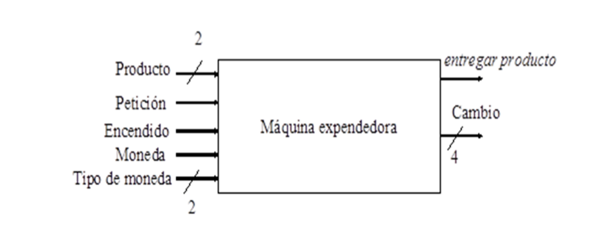

#### Diagrama ASM

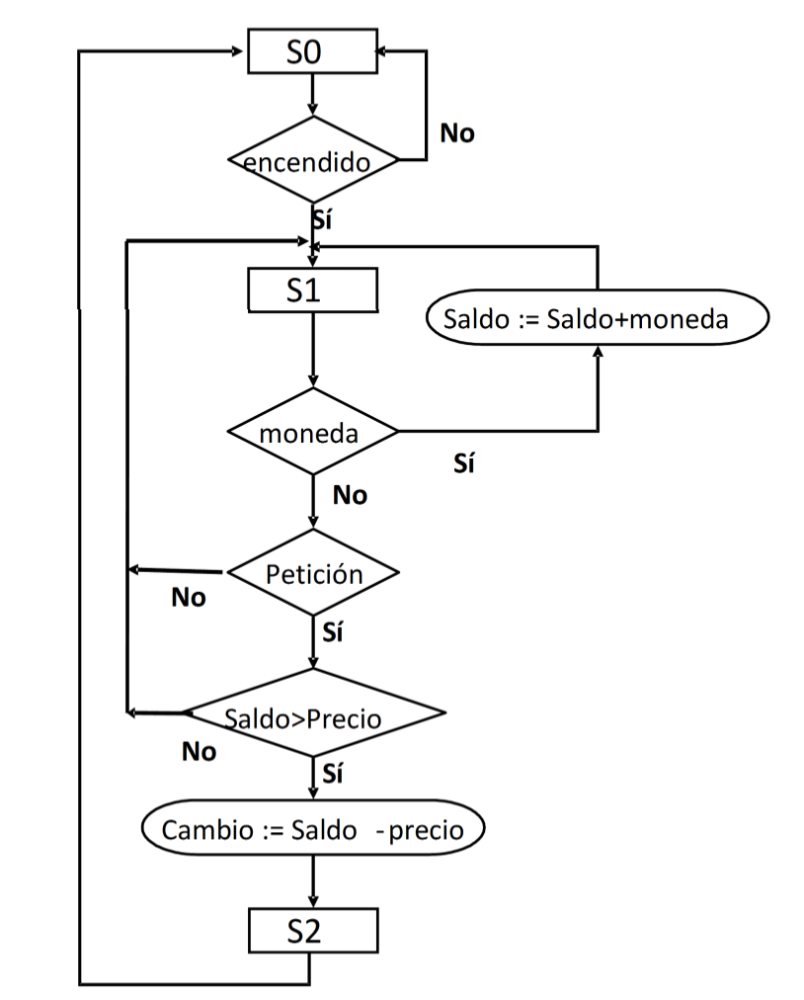

#### Ruta de datos para máquina expendedora

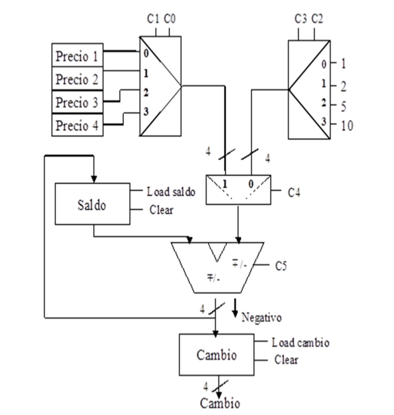

#### Controlador para máquina expendedora

```vhdl
library ieee;
use ieee.std_logic_1164.all;

entity controller is 
  port (
    clk, rst: in std_logic;
    peticion: in std_logic;
    encendido: in std_logic;
    moneda: in std_logic;
    entregar_producto: out std_logic;
    negativo: in std_logic;
    tipo_moneda: in std_logic_vector(1 downto 0);
    producto: in std_logic_vector(1 downto 0);
    control: out std_logic_vector(7 downto 0)
  )
end controller;

architecture behavioural of controller is
  type state is (S0, S1, S2);
  signal current_state, next_state: state;

  signal control_aux: std_logic_vector(7 downto 0);
  alias mux_prod : std_logic_vector(1 downto 0) is control_aux(1 downto 0);
  alias mux_mond : std_logic_vector(1 downto 0) is control_aux(3 downto 2);
  alias sel_inpt : std_logic is control_aux(4);
  alias op       : std_logic is control_aux(5);
  alias ld_saldo : std_logic is control_aux(6);
  alias ld_camb  : std_logic is control_aux(7);
begin
  control <= control_aux;

  change_state: process(clk, rst)
  begin
    if rising_edge(clk) then
      if rst = '1' then
        current_state <= S0;
      else
        current_state <= next_state;
      end if;
    end if;
  end process;

  calc_state: process(current_state, moneda, peticion, encendido, negativo, tipo_moneda, producto)

  begin
    control_aux <= (others => '0');
    next_state <= current_state;
    entregar_producto <= '0';
    mux_mond <= tipo_moneda;
    mux_prod <= producto;

    case current_state is
      when S0 =>
        entregar_producto <= '0';        
        if encendido = '1' then
          next_state <= S1;
        end if;
      when S1 =>
        if moneda = '1' then
          sel_inpt <= '0';
          op <= '0';
          ld_saldo <= '1';
        else
          if peticion = '1' then
            sel_inpt <= '1';
            op <= '1';
            if negativo = '0' then
              ld_saldo <= '1';
              ld_camb <= '1';
              next_state <= S2;
            end if;
          end if;
        end if;
      when S2 =>
        entregar_producto <= '1';
        next_state <= S0;
    end case;
  end process;
end behavioural;
```

#### Cronograma para máquina expendedora

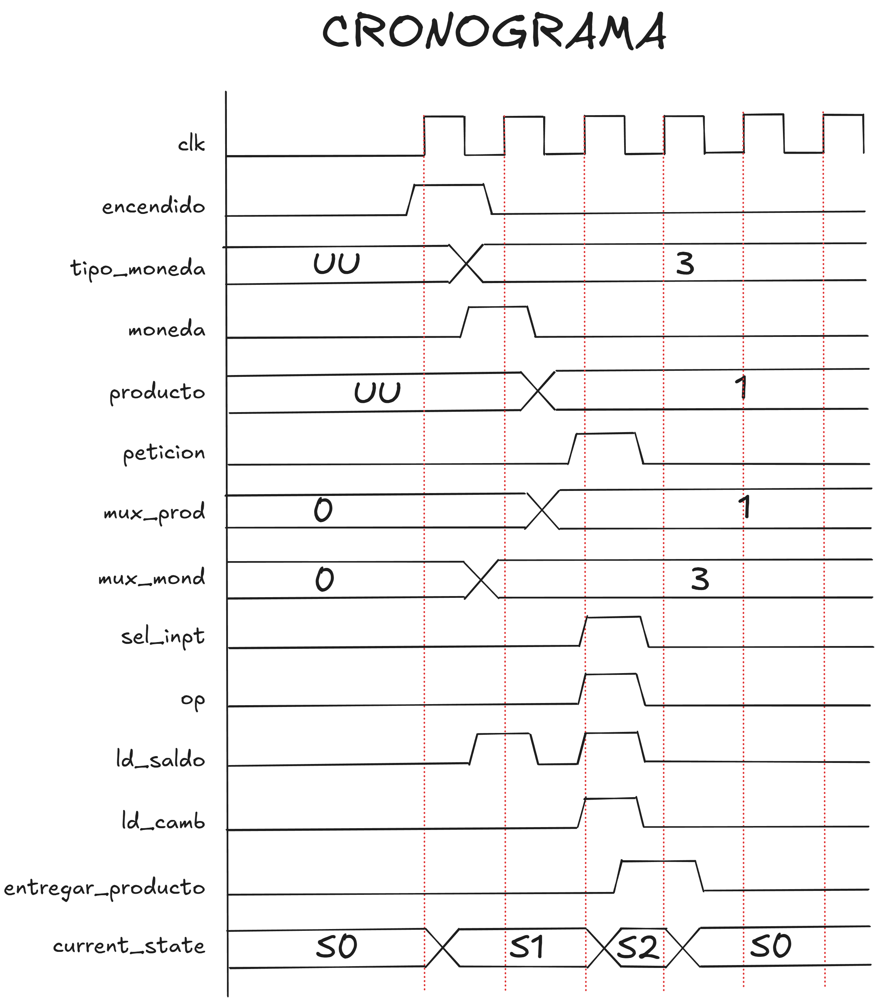

### 2. Diseñar la unidad de control del sistema con la siguiente especificación

* Un tren viaja desde un origen a un destino a 50km
* Existe una parada a 15km del origen
* Flujo del sistema:
  1. El tren comienza a viajar al pulsar `inicio`.
  2. El tren avanza un kilometro por ciclo y se activa `tren_circulando` hasta llegar al destino.
  3. Al llegar a la parada intermedia, el tren espera 10 ciclos y activa `parada`.
  4. Cuando el tren llega a su destino activa `fin`.

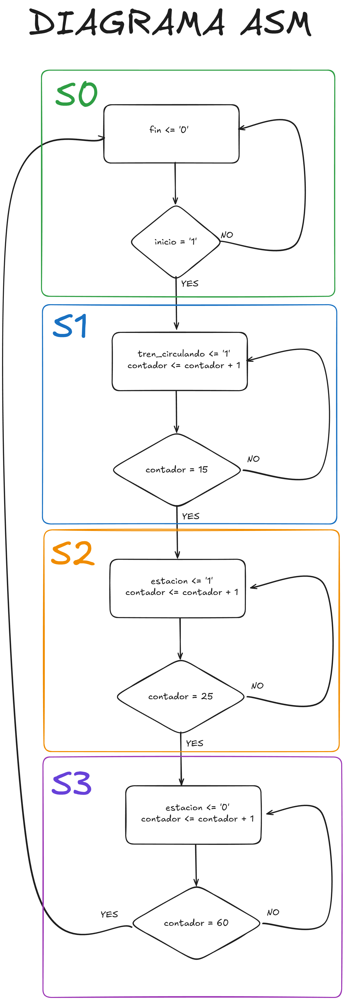

### 3. Realizar el siguiente ejercicio sobre una máquina de lavado con la siguiente especificación

* El sistema tiene cinco entradas: inicio, monedas, lavar, fa y fj
* El sistema tiene tres salidas: a, j y fin
* Flujo del sistema:
  1. El usuario pulsa el botón `inicio` y después introduce sus monedas. Después pulsa el botón lavar y el sistema comienza a funcionar
  2. Si el número de monedas es 0 se regresa al estado inicial
  3. Si el número de monedas es 1, entonces el sistema activa la señal `A` hasta que la entrada `FA` se active, volviendo al estado inicial.
  4. Si el número de monedas es mayor que uno: el sistema lava (como con una moneda), enjabona (cambiando `J` por `A` y `FJ` por `FA`).

#### Diagrama a ASM

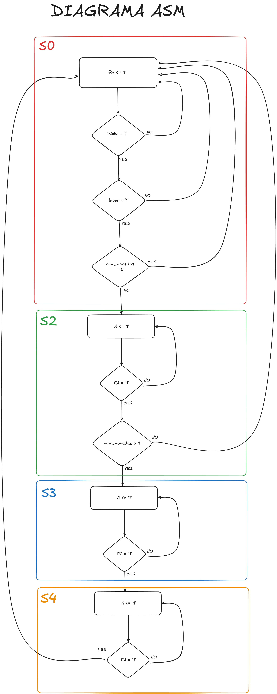

#### Ruta de datos del lavado

```vhdl
entity datapath_lavado is
  port (
    clk   : in  std_logic;
    rst   : in  std_logic;

    c_clr : in  std_logic;
    c_ld  : in  std_logic;
    c_inc : in  std_logic;

    C0    : out std_logic;
    C1    : out std_logic;
    C2    : out std_logic
  );
end datapath_lavado;

architecture rtl of datapath_lavado is
  signal C          : std_logic_vector(1 downto 0);
  signal C_inc_val  : std_logic_vector(1 downto 0);
begin

  C_inc_val <= 
      "11" when C = "11" else
      std_logic_vector(unsigned(C) + 1);

  process(clk, rst)
  begin
    if rst = '1' then
      C <= "00";
    elsif rising_edge(clk) then
      if c_clr = '1' then
        C <= "00";
      elsif c_ld = '1' then
        if c_inc = '1' then
          C <= C_inc_val;
        end if;
      end if;
    end if;
  end process;

  C0 <= '1' when C = "00" else '0';
  C1 <= '1' when C = "01" else '0';
  C2 <= '1' when C(1) = '1' else '0';

end rtl;
```

#### Unidad de control del lavado

```vhdl
entity uc_lavado is
  port (
    clk     : in  std_logic;
    rst     : in  std_logic;

    inicio  : in  std_logic;
    lavar   : in  std_logic;
    fa      : in  std_logic;
    fj      : in  std_logic;
    monedas : in  std_logic;

    C0      : in  std_logic;
    C1      : in  std_logic;
    C2      : in  std_logic;

    a       : out std_logic;
    j       : out std_logic;
    fin     : out std_logic;

    c_clr   : out std_logic;
    c_ld    : out std_logic;
    c_inc   : out std_logic
  );
end uc_lavado;

architecture moore of uc_lavado is

  type state_t is (S0_IDLE, S1_MONEDAS, S2_AGUA1,
                   S3_JABON, S4_AGUA2, S5_FIN);

  signal state, next_state : state_t;

begin
  process(clk, rst)
  begin
    if rst = '1' then
      state <= S0_IDLE;
    elsif rising_edge(clk) then
      state <= next_state;
    end if;
  end process;

  process(state, inicio, lavar, fa, fj, C0, C1, C2)
  begin
    next_state <= state;

    case state is
      when S0_IDLE =>
        if inicio = '1' then
          next_state <= S1_MONEDAS;
        end if;

      when S1_MONEDAS =>
        if lavar = '1' then
          if C0 = '1' then
            next_state <= S0_IDLE;
          else
            next_state <= S2_AGUA1;
          end if;
        end if;

      when S2_AGUA1 =>
        if fa = '1' then
          if C1 = '1' then
            next_state <= S5_FIN;
          else
            next_state <= S3_JABON;
          end if;
        end if;

      when S3_JABON =>
        if fj = '1' then
          next_state <= S4_AGUA2;
        end if;

      when S4_AGUA2 =>
        if fa = '1' then
          next_state <= S5_FIN;
        end if;

      when S5_FIN =>
        next_state <= S0_IDLE;
    end case;
  end process;

  process(state, monedas)
  begin
    a     <= '0';
    j     <= '0';
    fin   <= '0';
    c_clr <= '0';
    c_ld  <= '0';
    c_inc <= '0';

    case state is
      when S0_IDLE =>
        c_clr <= '1';

      when S1_MONEDAS =>
        c_ld  <= '1';
        c_inc <= monedas;

      when S2_AGUA1 =>
        a <= '1';

      when S3_JABON =>
        j <= '1';

      when S4_AGUA2 =>
        a <= '1';

      when S5_FIN =>
        fin   <= '1';
        c_clr <= '1';
    end case;
  end process;

end moore;
```

#### Diagrama bloques de lavado E/S

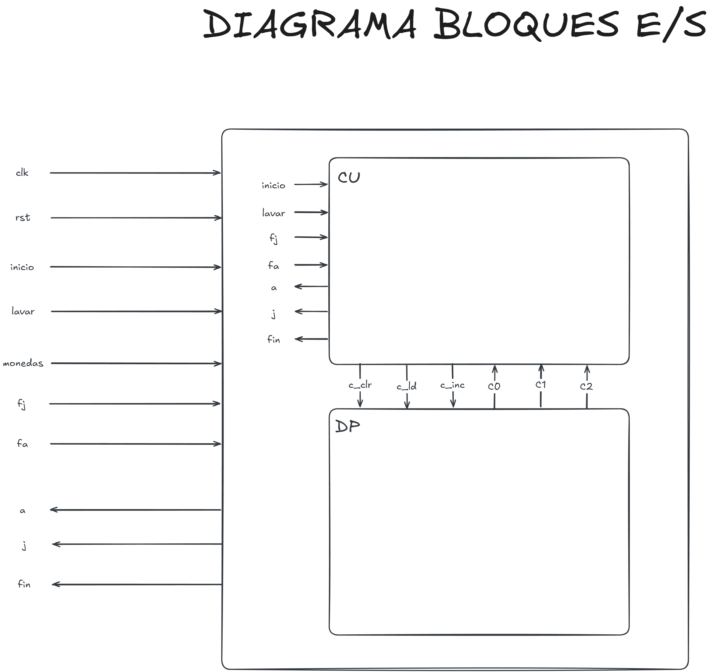

### 4. Diseña el siguiente sistema

* El juego consiste en adivinar un número de 0 a 15.
* Se tiene 3 oportunidades y 3 premios respectivamente.
* El juego tiene un contador a 100MHz para la generación "aleatoria".
* El juego no comienza hasta que se activa `jugar`.
* En ese momento, el jugador inserta un número y el juego comienza a generar.
* El sistema determina el número al salir activarse `parar`.
* Si no se ha acertado se repite el proceso restando una oportunidad.
* Si no se ha acertado en ninguna de las oportunidades se activará `pierdo` para después regresar al estado inicial.
* Si en alguna de las oportunidades se acierta, se activa `gano` para después regresar al estado inicial.

#### Diagrama ASM del juego

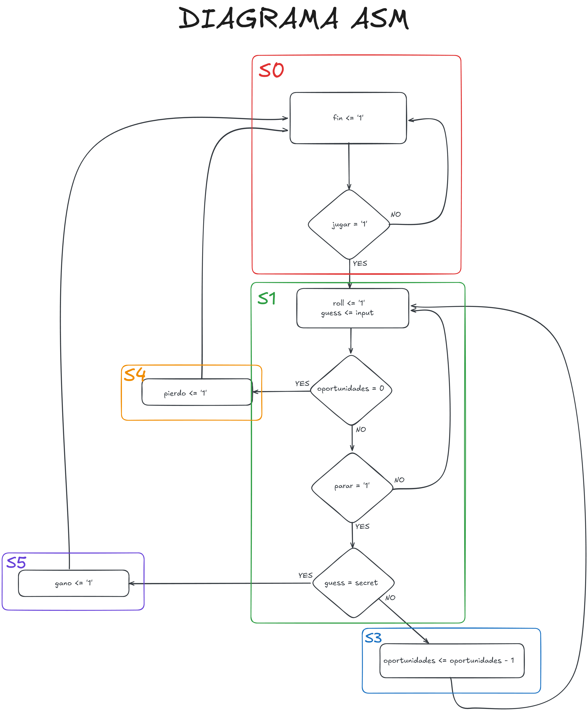

#### Datapath del juego

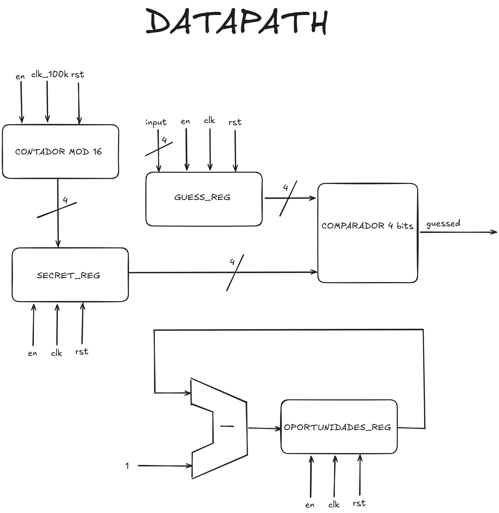

### 6. Diseñar la ruta de datos para la suma de dos números codificados en BCD

* El sistema tiene dos entradas: dirA y dirB
* El sistema tiene una salida: suma
* Las entradas se almacenan al activarse `empezar`
* En un ciclo, se puede acceder a un elemento de la memoria, primero A y luego B
* Los datos deben sumarse y representarse correctamente

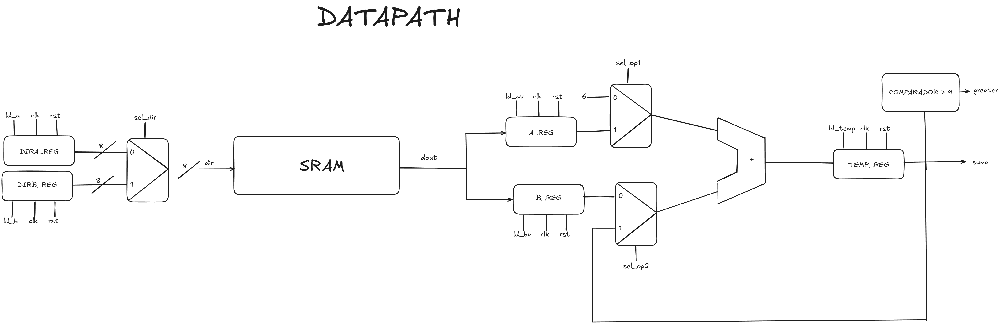

### 7. Diseñar el siguiente sistema
Se debe diseñar un sistema algorítmico que implemente un juego electrónico de cartas similar al 7 y media. El sistema genera cartas con valores entre 1 y 10 mediante un contador y permite al jugador solicitar cartas sucesivas mientras la suma acumulada de los valores obtenidos no supere el umbral establecido.

El funcionamiento es el siguiente: inicialmente el sistema permanece inactivo hasta que el jugador pulsa el botón jugar. A partir de ese momento, el sistema comienza a barajar las cartas (el contador genera valores continuamente). Cuando el jugador activa la señal pedir carta, se toma el valor actual generado y se suma al marcador, que almacena la suma de todas las cartas obtenidas.

Tras cada actualización del marcador, el sistema compara su valor con 11. Si el marcador supera dicho valor, el jugador pierde, se activa la señal pierdo durante un ciclo de reloj y el sistema vuelve al estado inicial. Si el marcador es menor o igual que 11, el sistema continúa barajando y el jugador puede decidir entre pedir una nueva carta o plantarse.

Si el jugador decide plantarse, el sistema activa la señal fin durante un ciclo de reloj y regresa al estado inicial. El diseño debe incluir el camino de datos, utilizando únicamente sumadores, contadores, registros y puertas lógicas, y la unidad de control, especificada mediante el diagrama de estados y la tabla de salidas.

#### Ruta de datos del juego de cartas

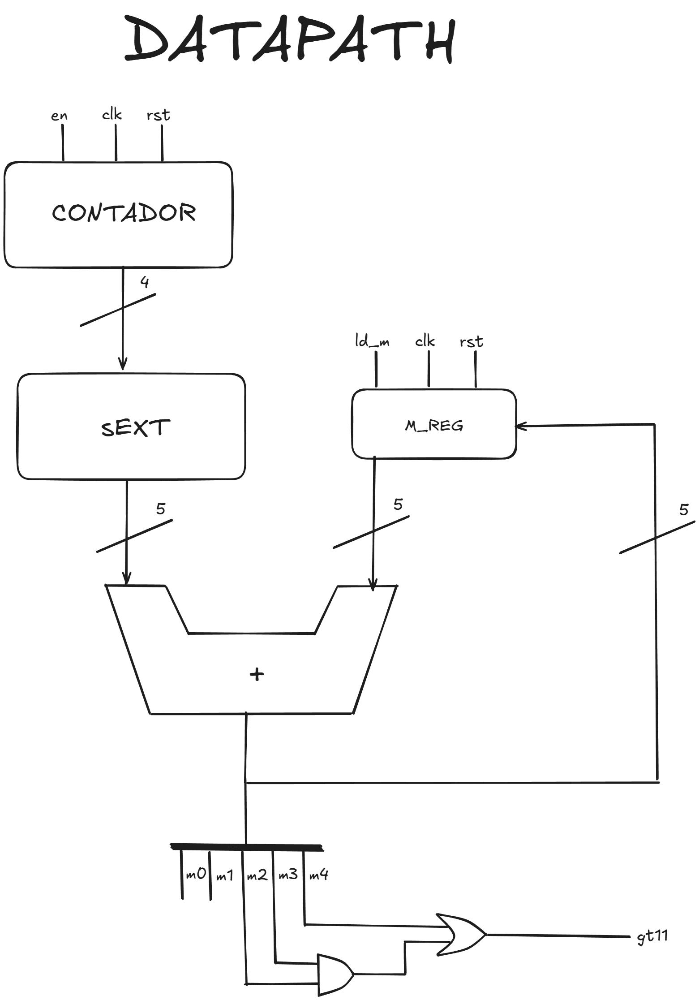

#### Controlador del juego de cartas

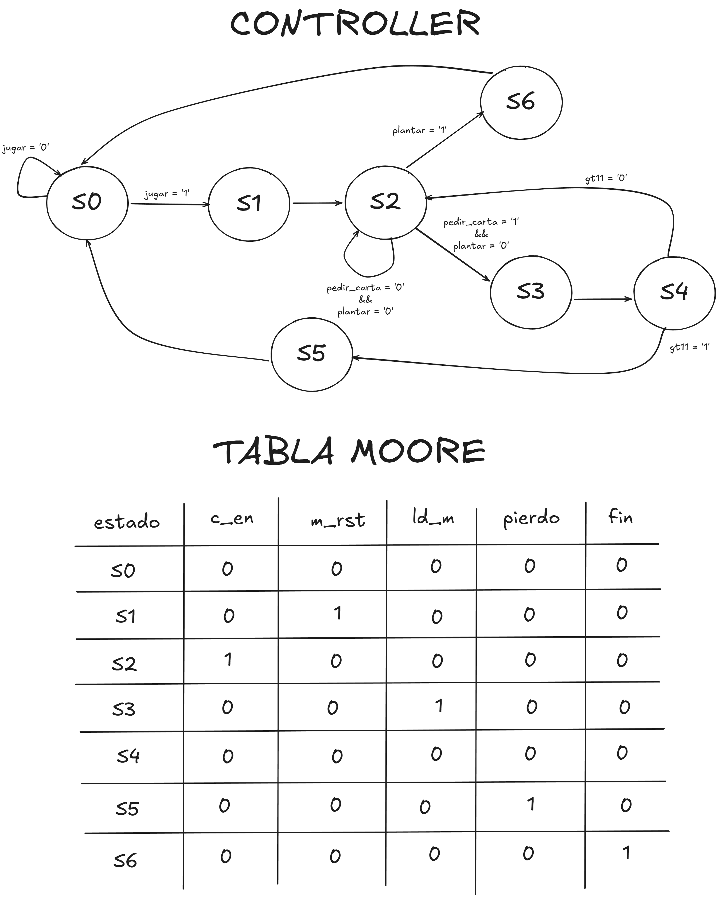

### 8. Diseñar el controlador de un impresor de tickets de un parking

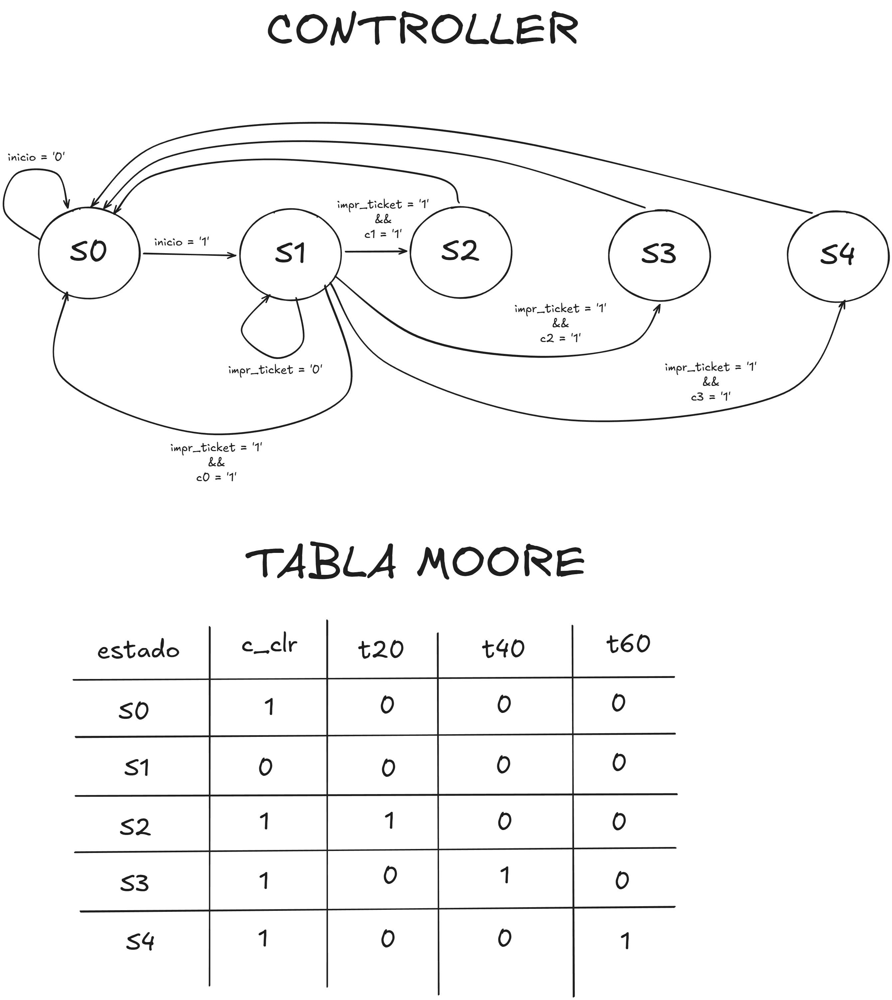

### 9. Diseñar el controlador de la apertura de una puerta

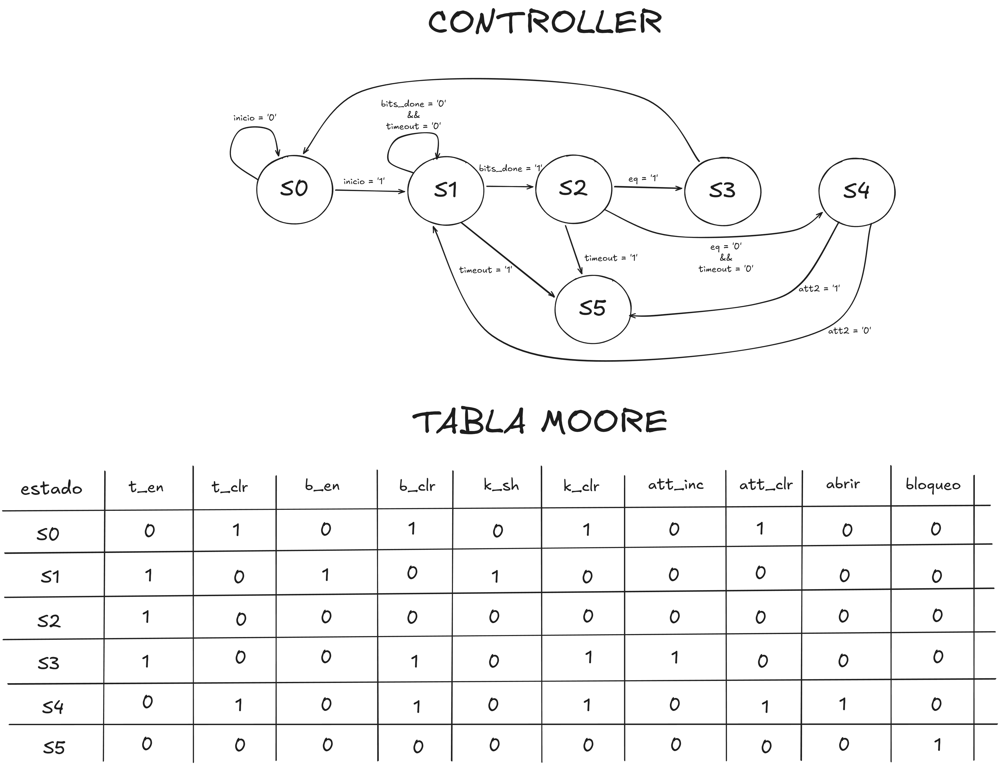
