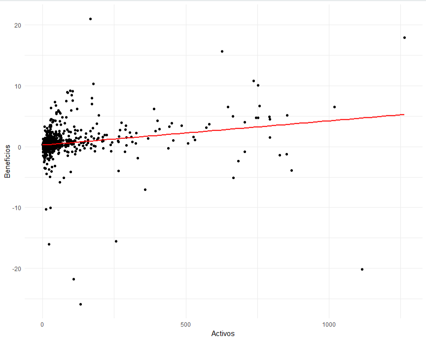
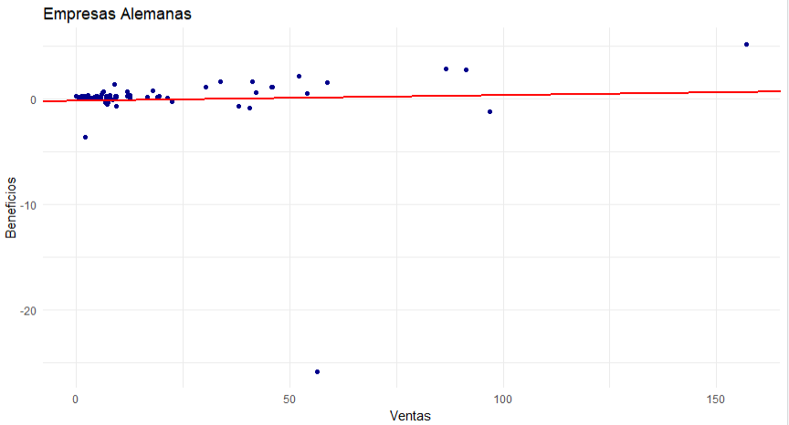
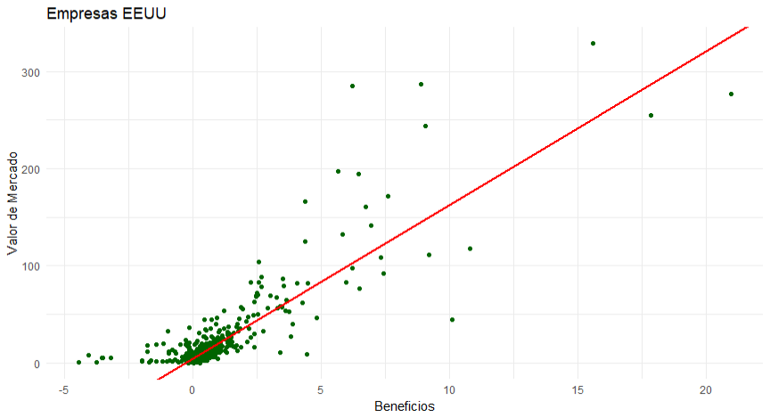

# Ejercicio Forbes - Probabilidad y Estadística

## Mario González García

---

Responda a las siguientes preguntas en base a la información del
conjunto de datos” Forbes2000”.

1. ¿Se puede decir que existe una relación lineal entre los beneficio
y el activo de las empresas? Elimine los datos faltantes.

2. Obtenga el coeficiente de determinación del modelo de regresión
lineal simple que permite explicar los beneficios de las empresas
alemanas a partir de sus ventas. ¿Cómo se interpreta este
resultado?

3. Estime un modelo de regresión lineal simple que explique el valor
de mercado de las empresas de Estados Unidos a partir de sus
beneficios. Escriba la recta de regresión que permite estimar el
valor de mercado a partir de los beneficios de una empresa y
analice su fiabilidad en base a los coeficientes de correlación y
determinación.

## Procedimiento

Para el análisis de este ejercicio se ha utilizado R con Rstudio. Se han usado las librerías:

1. **readxl**. Para importar los datos del enunciado desde la hoja excel.
2. **gglplot2**. Para graficar de los datos.

El script completo es el siguiente:

```r
library(readxl)
library(ggplot2)

forbes <- read_excel("Forbes2000.xlsx")

########################################################
# a) RELACIÓN ENTRE BENEFICIOS Y ACTIVOS
########################################################

data_pa <- na.omit(forbes[, c("profits", "assets")])

X <- data_pa$assets
Y <- data_pa$profits
n <- length(X)

# Medias
x_bar <- mean(X)
y_bar <- mean(Y)

# Varianza de X
Sx2 <- var(X)

# Covarianza
Sxy <- cov(X, Y)

# Coeficiente de correlación lineal (Pearson)
r <- cor(X, Y)

# Coeficiente de determinación
R2 <- r^2

x_bar
y_bar
Sxy
r
R2

# Gráfico
ggplot(data_pa, aes(x = assets, y = profits)) +
  geom_point() +
  geom_smooth(method = "lm", se = FALSE, color = "red") +
  labs(x = "Activos", y = "Beneficios") +
  theme_minimal()

########################################################
# b) EMPRESAS ALEMANAS – REGRESIÓN LINEAL SIMPLE
########################################################

germany <- subset(forbes, country == "Germany")
germany <- na.omit(germany[, c("sales", "profits")])

Xg <- germany$sales
Yg <- germany$profits

# Medias
xg_bar <- mean(Xg)
yg_bar <- mean(Yg)

# Varianza de X
Sxg2 <- var(Xg)

# Covarianza
Sxy_g <- cov(Xg, Yg)

# Pendiente (b)
b_g <- Sxy_g / Sxg2

# Intercepto (a)
a_g <- yg_bar - b_g * xg_bar

# Correlación y R2
r_g <- cor(Xg, Yg)
R2_g <- r_g^2

a_g
b_g
R2_g

# Recta estimada
cat("Recta Alemania: Y =", a_g, "+", b_g, "X\n")

# Gráfico
ggplot(germany, aes(x = sales, y = profits)) +
  geom_point(color = "darkblue") +
  geom_abline(intercept = a_g, slope = b_g, 
              color = "red", size = 1) +
  labs(
    title = "Empresas Alemanas",
    x = "Ventas",
    y = "Beneficios"
  ) +
  theme_minimal()

########################################################
# c) EMPRESAS USA – REGRESIÓN LINEAL SIMPLE
########################################################

usa <- subset(forbes, country == "United States")
usa <- na.omit(usa[, c("profits", "marketvalue")])

Xu <- usa$profits
Yu <- usa$marketvalue

# Medias
xu_bar <- mean(Xu)
yu_bar <- mean(Yu)

# Varianza
Sxu2 <- var(Xu)

# Covarianza
Sxy_u <- cov(Xu, Yu)

# Pendiente
b_u <- Sxy_u / Sxu2

# Intercepto
a_u <- yu_bar - b_u * xu_bar

# Correlación y R2
r_u <- cor(Xu, Yu)
R2_u <- r_u^2

a_u
b_u
R2_u

cat("Recta EEUU: Y =", a_u, "+", b_u, "X\n")

# Gráfico

ggplot(usa, aes(x = profits, y = marketvalue)) +
  geom_point(color = "darkgreen") +
  geom_abline(intercept = a_u, slope = b_u, 
              color = "red", size = 1) +
  labs(
    title = "Empresas EEUU",
    x = "Beneficios",
    y = "Valor de Mercado"
  ) +
  theme_minimal()

```

## Análisis

### Activos y beneficios

#### Medidas

Con la ejecución del script se ha determinado la siguiente información:

* $S_{xy} = 39.5289996891426$
* $r = 0.224357260111459$
* $R^2 = 0.0503361801647211$

#### Gráfico



#### Interpretación

Al ser el coeficiente de correlación lineal ($r$) positivo determinamos que existe una relación lineal **positiva** entre activos y beneficios. Sin embargo, como se puede apreciar obsevando $R^2$ esta relación es muy débil. Por lo tanto, no puede afirmarse que exita una relación lineal fuerte entre ambas variables.

Aunque la covarianza es positiva, el bajo valor de $r$ y de $R^2$ indica que la dependencia lineal es débil y el modelo lineal simple no resulta adecuado para explicar los beneficios a partir de los activos.

### Empresas alemanas: Beneficios en función de ventas

#### Medidas para empresas alemanas

* $S_{xy} = 4.26019427884616$
* $b = \frac{S_{xy}}{S_{xx}} = 0.00530534560833243$
* $a = \overline{y} - b\,\overline{x} = -0.148406273758144$
* $R^2 = 0.00193591414215822$

Recta de regresión:
$$
Y = 0.00530534560833243X - -0.148406273758144
$$

#### Gráfico para empresas alemanas



#### Interpretación para empresas alemanas

El coeficiente de determinación es ínfimo ($0.0019$), por lo que, linealmente, no se puede explicar los beneficios en función de las ventas para empresas alemanas. Concluyendo, no existe dependencia estadística lineal.

### Empresas estadounidenses: Valor de mercado en fución de beneficios

#### Medidas para empresas estadounidenses

* $S_{xy} =50.6017319352275$
* $b = \frac{S_{xy}}{S_{xx}} = 15.802985371383$
* $a = \overline{y} - b\,\overline{x} = 5.16782744650793$
* $R^2 = 0.731628312620963$

Recta de regresión:
$$
Y = 15.802985371383X + 5.16782744650793
$$

#### Gráfico para empresas estadounidenses



#### Interpretación para empresas estadounidenses

En este caso **SÍ** existe una fuerte dependencia estadística (lineal) entre los beneficios de las empresas estadounidenses y su valor de mercado. Su coeficiente de determinación supera en valor absoluto el $0.7$, lo cual es indicativo de esta fuerte relación.

Dado que r es positivo, la pendiente también lo es, en coherencia con la propiedad de que el signo de la pendiente viene determinado por el signo de la covarianza.
